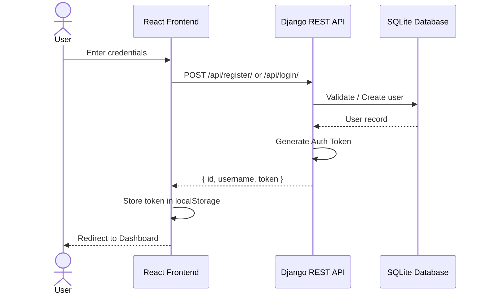
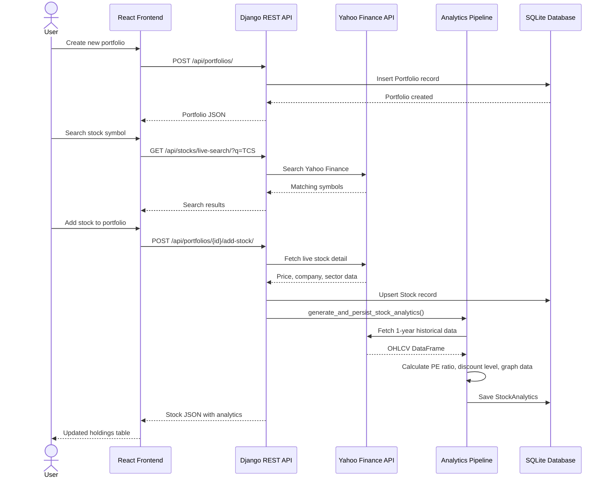
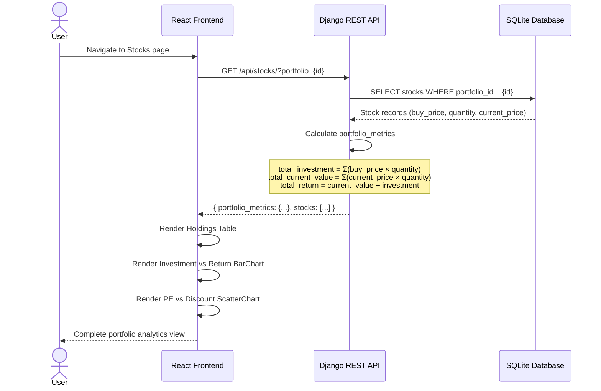
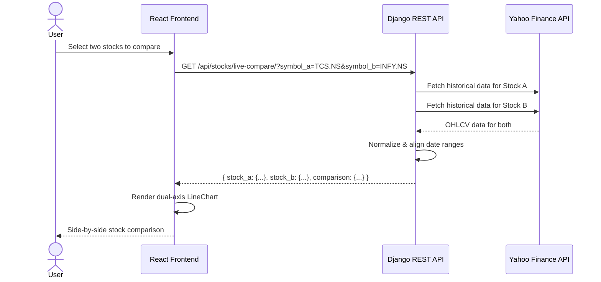

# EquityLens — AI-Powered Financial Analytics Dashboard

**EquityLens** is a full-stack financial analytics platform built with **Django REST Framework** and **React + Vite**. It combines real-time market data, ML-driven predictions, and interactive visualizations to help investors analyze portfolios, forecast stock prices, and discover undervalued opportunities.

---

## Table of Contents

- [Features](#features)
- [Tech Stack](#tech-stack)
- [Architecture Overview](#architecture-overview)
- [Sequence Diagrams](#sequence-diagrams)
- [Project Structure](#project-structure)
- [Getting Started](#getting-started)
- [API Endpoints](#api-endpoints)

---

## Features

| Module | Description |
|---|---|
| **Portfolio Management** | Create, update, delete portfolios. Add/remove stocks with live Yahoo Finance lookup. |
| **Stock Analytics Pipeline** | KMeans clustering, Linear Regression, Logistic Regression on portfolio holdings. |
| **AI Stock Prediction** | Multi-model forecasting (Linear Regression, ARIMA, RNN, CNN) with configurable horizons. |
| **Model Accuracy Metrics** | MAE, RMSE, MAPE evaluation with quality badges (Excellent / Good / Acceptable / Poor). |
| **Investment vs Return** | Portfolio-level BarChart showing total investment, current value, and profit/loss. |
| **PE vs Discount Scatter** | ScatterChart mapping PE Ratio × Discount Level to identify undervalued stocks. |
| **Gold vs Silver ML** | Comparative analysis pipeline using regression, PCA, and correlation heatmaps. |
| **Nifty 50 PCA** | Principal Component Analysis on Nifty 50 index constituents. |
| **Live Ticker** | Real-time streaming ticker bar with market price updates. |
| **Stock Comparison** | Side-by-side historical chart comparison of any two symbols. |
| **Crypto AI Forecasting** | Time-series forecasting for cryptocurrency assets. |

---

## Tech Stack

### Backend
- Python 3.10+
- Django 5.x + Django REST Framework
- scikit-learn (Linear/Logistic Regression, KMeans, MLPRegressor, RandomForest)
- statsmodels (ARIMA)
- yfinance (real-time market data)
- pandas / numpy
- SQLite (development)

### Frontend
- React 18 + Vite
- Recharts (BarChart, LineChart, ScatterChart, AreaChart)
- Framer Motion (animations)
- Tailwind CSS
- Axios (API client)
- React Router v6

---

## Architecture Overview

```
┌─────────────────────────────────────────────────────────┐
│                    React Frontend (Vite)                 │
│  Pages: Landing, Portfolio, Stocks, GoldSilver, Nifty50 │
│  Components: PortfolioAnalysis, StockTable, LiveTicker   │
│  Charts: Recharts (Bar, Line, Scatter, Area)            │
└────────────────────────┬────────────────────────────────┘
                         │  Axios HTTP (REST JSON)
                         ▼
┌─────────────────────────────────────────────────────────┐
│              Django REST Framework Backend              │
│                                                         │
│  api/views.py     → ViewSets & APIViews                 │
│  api/serializers  → Data serialization layer             │
│  analytics/       → ML pipelines, forecasting, yfinance │
│  ml_pipeline/     → Gold-Silver & Nifty PCA pipelines   │
│  stocks/services/ → Clustering, Regression, Logistic    │
│  portfolio/       → Django ORM models                    │
└────────────────────────┬────────────────────────────────┘
                         │
              ┌──────────┴──────────┐
              │  SQLite Database    │
              │  (db.sqlite3)       │
              └──────────┬──────────┘
                         │
              ┌──────────┴──────────┐
              │  Yahoo Finance API  │
              │  (yfinance)         │
              └─────────────────────┘
```

---

## Sequence Diagrams

### 1. User Authentication Flow



### 2. Portfolio Creation & Stock Addition



### 3. AI Stock Prediction Flow

```mermaid
sequenceDiagram
    actor User
    participant Frontend as React Frontend
    participant API as Django REST API
    participant Predictor as Prediction Engine
    participant Yahoo as Yahoo Finance API
    participant Metrics as Accuracy Calculator

    User->>Frontend: Select Model + Stock + Horizon
    Frontend->>API: GET /api/predict/?symbol=TCS.NS&model=arima&horizon=3_months
    API->>Predictor: predict_stock_price(symbol, model, horizon)
    Predictor->>Yahoo: Download historical price data
    Yahoo-->>Predictor: Historical DataFrame

    rect rgb(40, 40, 80)
        Note over Predictor,Metrics: Validation Phase
        Predictor->>Predictor: 80/20 train-validation split
        Predictor->>Predictor: Train model on 80% data
        Predictor->>Predictor: Predict on 20% validation set
        Predictor->>Metrics: compute_metrics(actual, predicted)
        Metrics-->>Predictor: { mae, rmse, mape }
    end

    rect rgb(40, 80, 40)
        Note over Predictor: Forecasting Phase
        Predictor->>Predictor: Retrain on 100% data
        Predictor->>Predictor: Generate N-day forecast
    end

    Predictor->>Predictor: format_prediction_response()
    Note over Predictor: Add volatility, stochastic drift, smoothing, confidence bands
    Predictor-->>API: { historical, predictions, upper/lower bounds, metrics }
    API-->>Frontend: Full prediction JSON

    Frontend->>Frontend: Render LineChart + Area (confidence bands)
    Frontend->>Frontend: Render Accuracy Metrics table
    Frontend->>Frontend: Display MAPE quality badge
    Frontend-->>User: Interactive prediction dashboard
```



### 4. Portfolio Analytics Pipeline

```mermaid
sequenceDiagram
    actor User
    participant Frontend as React Frontend
    participant API as Django REST API
    participant Pipeline as ML Analysis Pipeline
    participant DB as SQLite Database

    User->>Frontend: Click "AI Analysis" tab
    Frontend->>API: GET /api/portfolios/{id}/analysis/
    API->>Pipeline: run_portfolio_analysis(portfolio_id)
    Pipeline->>DB: Fetch all stocks in portfolio
    DB-->>Pipeline: Stock queryset with analytics

    rect rgb(50, 40, 70)
        Note over Pipeline: ML Processing
        Pipeline->>Pipeline: Build DataFrame with features
        Pipeline->>Pipeline: KMeans Clustering (risk groups)
        Pipeline->>Pipeline: Linear Regression (price prediction)
        Pipeline->>Pipeline: Logistic Regression (buy signal)
        Pipeline->>Pipeline: Correlation matrix
    end

    Pipeline-->>API: { stocks[ ], correlation{ } }
    API-->>Frontend: Analysis JSON
    Frontend->>Frontend: Render cluster chart
    Frontend->>Frontend: Render correlation heatmap
    Frontend-->>User: AI analysis dashboard
```



### 5. Portfolio Investment vs Return Flow



### 6. Gold vs Silver ML Pipeline

```mermaid
sequenceDiagram
    actor User
    participant Frontend as React Frontend
    participant API as Django REST API
    participant Pipeline as Gold-Silver Pipeline
    participant Yahoo as Yahoo Finance API

    User->>Frontend: Open Gold vs Silver page
    Frontend->>API: GET /api/gold-silver/analysis/
    API->>Pipeline: run_gold_silver_pipeline()
    Pipeline->>Yahoo: Fetch Gold ETF data (GLD)
    Pipeline->>Yahoo: Fetch Silver ETF data (SLV)
    Yahoo-->>Pipeline: Historical price data

    rect rgb(60, 40, 40)
        Note over Pipeline: ML Analysis
        Pipeline->>Pipeline: Clean & merge datasets
        Pipeline->>Pipeline: Feature engineering
        Pipeline->>Pipeline: Train regression models
        Pipeline->>Pipeline: Cross-validation & metrics
        Pipeline->>Pipeline: Generate visualizations
    end

    Pipeline-->>API: { metrics, predictions, charts }
    API-->>Frontend: Analysis JSON
    Frontend->>Frontend: Render comparison charts
    Frontend-->>User: Gold vs Silver analytics
```



### 7. Live Stock Comparison Flow



---

## Project Structure

```
Equity_lens_final/
├── backend/
│   ├── manage.py
│   ├── requirements.txt
│   ├── db.sqlite3
│   ├── auto_invest/              # Django project settings
│   ├── accounts/                 # User authentication
│   ├── api/
│   │   ├── views.py              # REST API ViewSets & APIViews
│   │   ├── serializers.py        # DRF serializers
│   │   └── urls.py               # URL routing
│   ├── portfolio/
│   │   └── models.py             # Portfolio & Stock ORM models
│   ├── analytics/
│   │   ├── models.py             # StockAnalytics model
│   │   └── services/
│   │       ├── pipeline.py       # Analytics generation pipeline
│   │       ├── fetch_data.py     # Yahoo Finance data fetching
│   │       ├── indicators.py     # Technical indicators
│   │       ├── forecasting.py    # Time-series forecasting
│   │       ├── ticker.py         # Live ticker service
│   │       ├── yahoo_search.py   # Yahoo Finance search & detail
│   │       ├── stock_prediction.py  # Model dispatcher
│   │       └── prediction_models/
│   │           ├── base.py          # Shared utilities & response formatting
│   │           ├── linear_reg.py    # Linear Regression predictor
│   │           ├── arima_model.py   # ARIMA predictor
│   │           ├── rnn_model.py     # RNN (MLPRegressor) predictor
│   │           ├── cnn_model.py     # CNN (RandomForest) predictor
│   │           └── compute_metrics.py  # MAE, RMSE, MAPE calculator
│   ├── stocks/services/
│   │   ├── pipeline.py           # Portfolio ML analysis pipeline
│   │   ├── cluster.py            # KMeans clustering
│   │   ├── regression.py         # Linear regression service
│   │   └── logistic.py           # Logistic regression service
│   └── ml_pipeline/
│       ├── gold_silver_pipeline.py  # Gold vs Silver analysis
│       ├── nifty_pca_pipeline.py    # Nifty 50 PCA analysis
│       ├── data_fetcher.py          # Data acquisition
│       ├── regression_model.py      # ML regression models
│       └── validation.py            # Cross-validation utilities
│
├── frontend/
│   ├── src/
│   │   ├── api/
│   │   │   ├── axios.js             # Axios instance with auth
│   │   │   └── stocks.js            # API service functions
│   │   ├── pages/
│   │   │   ├── Landing.jsx          # Landing / home page
│   │   │   ├── Login.jsx            # Authentication
│   │   │   ├── Register.jsx         # User registration
│   │   │   ├── Portfolio.jsx        # Portfolio CRUD
│   │   │   ├── Stocks.jsx           # Holdings + analytics charts
│   │   │   ├── StockDetail.jsx      # Individual stock view
│   │   │   ├── LiveStockDetail.jsx  # Live market data view
│   │   │   ├── CompareStocks.jsx    # Side-by-side comparison
│   │   │   ├── GoldSilverAnalysis.jsx      # Gold vs Silver dashboard
│   │   │   ├── GoldSilverCorrelation.jsx   # Correlation analysis
│   │   │   └── Nifty50Analysis.jsx         # Nifty 50 PCA dashboard
│   │   ├── components/
│   │   │   ├── PortfolioAnalysis.jsx  # AI prediction + accuracy metrics
│   │   │   ├── CryptoForecasting.jsx  # Crypto AI forecasting
│   │   │   ├── StockTable.jsx         # Holdings data table
│   │   │   ├── Navbar.jsx             # Top navigation bar
│   │   │   ├── Sidebar.jsx            # Side navigation
│   │   │   ├── LiveTicker.jsx         # Streaming price ticker
│   │   │   ├── SearchBar.jsx          # Stock search component
│   │   │   └── Loader.jsx             # Loading spinner
│   │   └── utils/
│   │       └── currency.js            # Currency formatting helpers
│   └── index.html
│
└── README.md
```

---

## Getting Started

### Prerequisites
- Python 3.10+
- Node.js 18+
- npm or yarn

### Backend Setup

```bash
cd backend
pip install -r requirements.txt
python manage.py migrate
python manage.py runserver
```

The API server starts at `http://localhost:8000/api/`.

### Frontend Setup

```bash
cd frontend
npm install
npm run dev
```

The dev server starts at `http://localhost:5173/`.

---

## API Endpoints

| Method | Endpoint | Description |
|--------|----------|-------------|
| POST | `/api/register/` | Register new user |
| POST | `/api/login/` | Login & get auth token |
| GET | `/api/portfolios/` | List all portfolios |
| POST | `/api/portfolios/` | Create portfolio |
| POST | `/api/portfolios/{id}/add-stock/` | Add stock to portfolio |
| GET | `/api/portfolios/{id}/analysis/` | Run ML analysis pipeline |
| GET | `/api/stocks/?portfolio={id}` | List stocks with portfolio metrics |
| GET | `/api/stocks/live-search/?q={query}` | Search Yahoo Finance |
| GET | `/api/stocks/live-detail/?symbol={sym}` | Get live stock details |
| GET | `/api/stocks/live-compare/` | Compare two stocks |
| GET | `/api/predict/?symbol={sym}&model={m}&horizon={h}` | AI stock prediction |
| GET | `/api/gold-silver/analysis/` | Gold vs Silver ML pipeline |
| GET | `/api/nifty50-pca/` | Nifty 50 PCA analysis |
| GET | `/api/forecast/?asset={asset}` | Asset forecasting |
| GET | `/api/ticker/` | Live ticker data |

---

## License

This project is developed for academic and research purposes.
