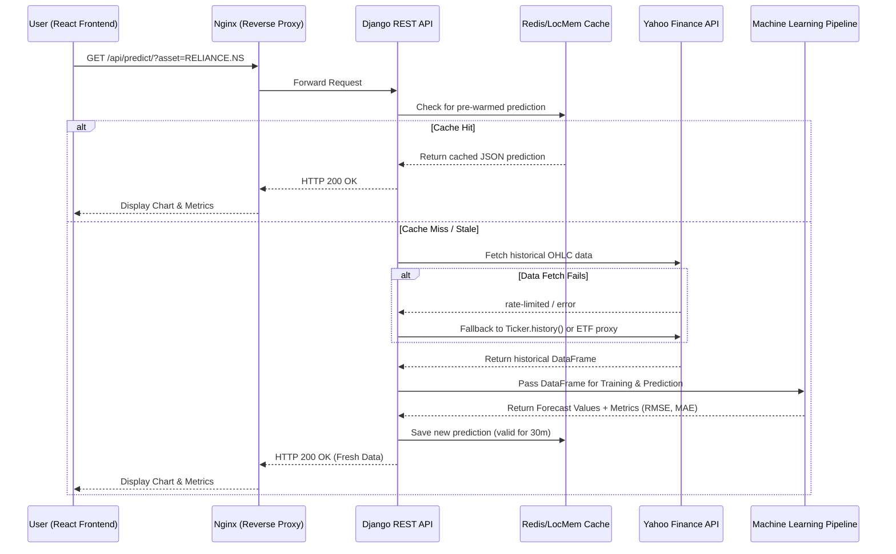

# EquityLens 📈

EquityLens is an advanced AI-powered continuous learning analytical platform for financial markets (Stocks, Commodities, and Cryptocurrencies). It leverages machine learning models (ARIMA, LSTM, CNN, Random Forest) to provide asset price predictions, paired with real-time market data directly integrated with Yahoo Finance. It also features explainable AI (XAI) using SHAP and LIME to interpret deep learning and ensemble predictions.

---

## 📸 Project Screenshots

<details>
<summary>Click to view screenshots!</summary>


</details>

*(You can add more screenshots just by dropping them in the above section)*

---

## 🚀 Key Features

* **Multi-Asset Forecasting:** Real-time and forward-looking predictions for Indian Equities (NSE), Gold, Silver, and Cryptocurrencies (BTC, ETH).
* **Advanced ML Pipeline:** Multiple prediction algorithms including Random Forest, ARIMA, LSTM, and simulated CNN/RNN.
* **Explainable AI (XAI):** Full transparency into what drives predictions using SHAP (feature importance) and LIME (local surrogate models).
* **NIFTY 50 Clustering:** Principal Component Analysis (PCA) and K-Means clustering for grouping large-cap Indian stocks by market behavior.
* **Robust Market Data:** Automatic multi-layer fallback strategy for `yfinance` to bypass cloud-provider IP rate limits.
* **Continuous Background Caching:** Prediction models pre-warm via cron schedules using Redis/LocMem, making frontend API hits lightning fast.

---

## 🛠 Tech Stack

**Frontend:**
* React (Vite)
* Tailwind CSS
* Recharts / Chart.js for visualization
* Axios for API integration

**Backend:**
* Python (Django 5.0+, Django REST Framework)
* Machine Learning: `scikit-learn`, `tensorflow`, `statsmodels`
* Market Data: `yfinance`, `pandas`, `numpy`
* Explainability: `shap`, `lime`

**Infrastructure & Deployment:**
* Gunicorn & Nginx
* Redis (Caching)
* PM2 (Process Manager)
* Azure Virtual Machines (Ubuntu)
* GitHub Actions (CI/CD Automated Deployment)

---

## 📐 System Architecture & Sequence Diagram

The following sequence diagram illustrates the flow of data from the user requesting a prediction to the AI models serving cached or live generated data.



---

## ⚙️ Local Setup and Installation

### 1. Clone the repository
```bash
git clone https://github.com/bhushantile20/EquityLens.git
cd EquityLens
```

### 2. Backend Setup
```bash
cd backend
python -m venv venv
source venv/bin/activate  # Or `venv\Scripts\activate` on Windows
pip install -r requirements.txt

# Setup Database and Demo Data
python manage.py makemigrations
python manage.py migrate
python manage.py create_demo_user

# Run server
python manage.py runserver
```

### 3. Frontend Setup
```bash
cd frontend
npm install

# Set up local environment variables
echo "VITE_API_BASE_URL=http://localhost:8000/api/" > .env

# Run development server
npm run dev
```

---

## 🌍 Production Deployment workflow

This project utilizes purely automated CI/CD deployments through GitHub Actions perfectly suited for Azure.

When code is pushed to the `main` branch:
1. **GitHub Actions** checks out the repository.
2. Code is securely teleported to the **Azure Server** via SSH/SCP.
3. A remote script is triggered that:
   * Rebuilds the Vite React dashboard for production.
   * Updates Python dependencies and runs `manage.py migrate`.
   * Auto-restarts the `PM2` Django process and `Nginx` reverse proxy.

*For detailed local-to-server configurations, please ensure CORS, CSRF, and Allowed Hosts are populated in your `.env` correctly.*
